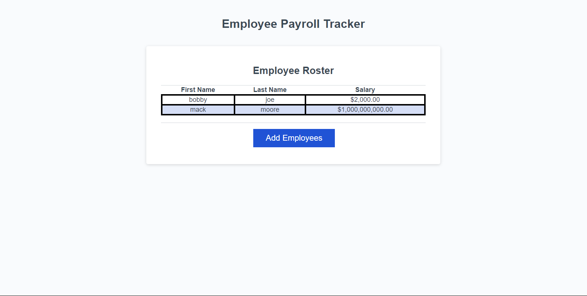

# 3-payroll-tracker

## Description

The third challenge assignment from a bootcamp where the task was to modify starter code to create an application that manages employee payroll data.

## Process

The process included adding an event listener for when clicking on a button, prompts show up. Employee data that was inputed, stored, and tracked included employee's first and last names and their salaries. I have included the parseInt and isNaN methods for the salary to ensure only numbers were recorded for the salaries. The process also included creating a confirm message. After an employee's data was inputed, a confirm message popped up to ask if user would like to add another employee, if not, a table of displayed of all employees.

## Links

Link to website used for this challenge.
https://mackemo.github.io/3-payroll-tracker/

Link to public Github repository for this challenge.
https://github.com/mackemo/3-payroll-tracker

## Installation

N/A

## Usage

This site was a practice assignment for bootcamp students but can be used to see how a simple website can be created by inspecting the webpage.

## Credits

N/A

## License

N/A

## Acknowledgement

Project was done by the knowledge learned from bootcamp instructor John. Also multiple references online were used (links below):

https://stackoverflow.com/questions/37287093/starting-a-javascript-prompt-after-a-button-is-clicked

https://stackoverflow.com/questions/1133770/how-to-convert-a-string-to-an-integer-in-javascript

https://www.w3schools.com/jsref/jsref_isnan_number.asp

https://stackoverflow.com/questions/29544371/finding-the-average-of-an-array-using-js

https://stackoverflow.com/questions/5915096/get-a-random-item-from-a-javascript-array
